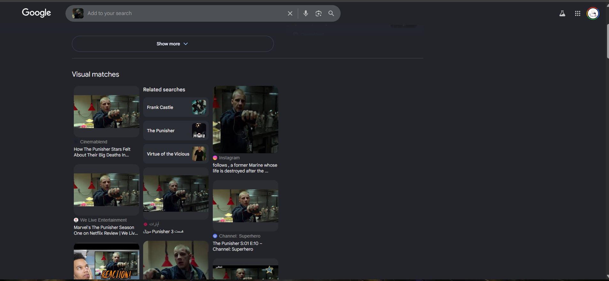
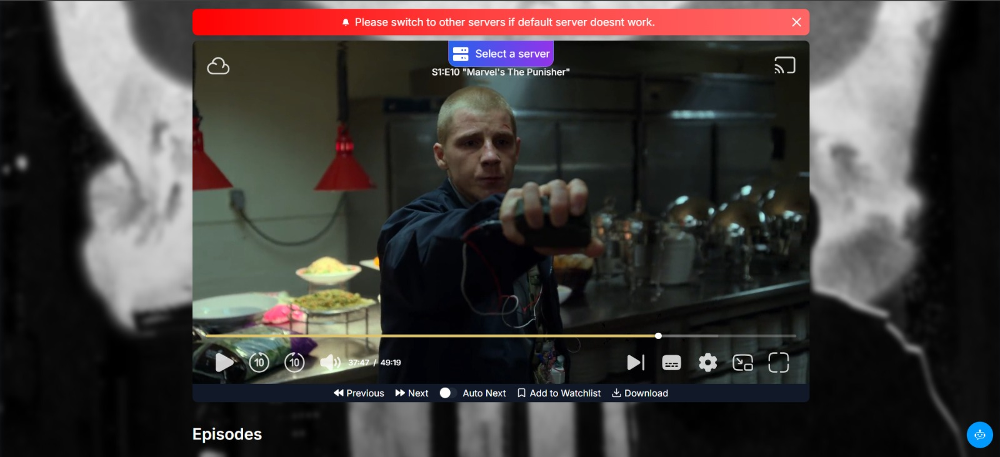
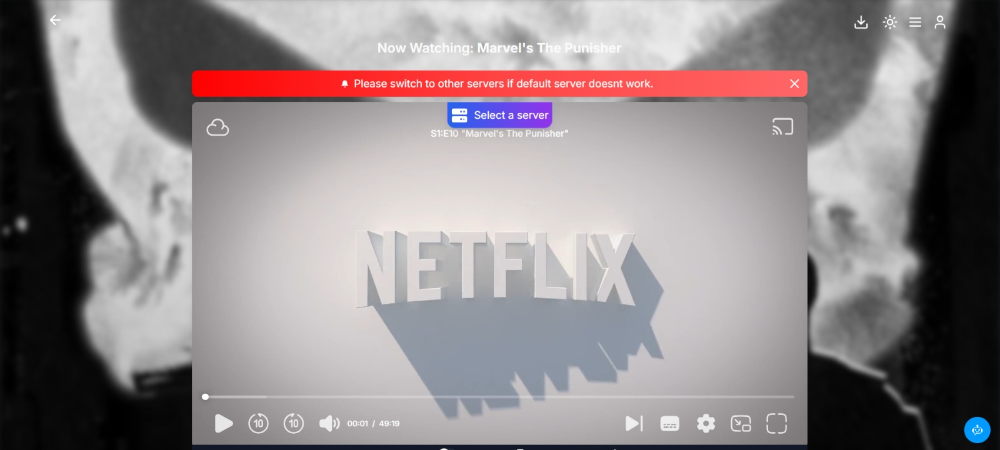

# Red Lantern Cut — OSINT Writeup

## Challenge Information
- **Name:** Red Lantern Cut
- **Points:** 270
- **Author:** 0x4sh
- **Category:** OSINT / Media Forensics
- **Flag Format:** `0xV01D{SeriesName_SXX_EXX_MM:SS}`

---

## 📜 Challenge Description

> A single frame has been extracted from a publicly released television production. The image belongs to a serialized narrative universe and represents an exact moment captured within a continuous episodic storyline.
>
> Your objective is to perform full OSINT analysis on the provided frame and determine its exact original context.
>
> **You must identify:**
> - The name of the series
> - The season number
> - The episode number
> - The exact timestamp of the frame (mm:ss)
> - The official title of this challenge
>
> All answers must be validated through reliable source matching and frame-level verification. Guessing is not acceptable.
>
> **SUBMISSION FORMAT:** > `0xV01D{SeriesName_SXX_EXX_MM:SS}`

---

## 💻 Methodology

### Step 1: Initial Reconnaissance (Visual Search)
The challenge provided a single frame extracted from a TV series storyline. To identify the source material, I performed a reverse image search using **Google Lens** on the provided frame.

The visual matches pinpointed the exact scene:
* **Series:** *The Punisher* (or *Marvel's The Punisher*)
* **Related Episode:** Season 1, Episode 10 (*"Virtue of the Vicious"*)



---

### Step 2: Locating the Video Source
With the exact season and episode identified, I navigated to **VidBox** to locate the video file for fine-grained frame matching. 

I scrubbed through the episode until the background layout, lighting, and the actor's stance perfectly matched the challenge image. 
* **Initial Timestamp Found:** 37:47



---

### Step 3: Calibrating the Time Offset for Exact Original Context
Because the challenge requirements explicitly demand the **exact original context** of the production frame rather than its modern streaming placement, platform-specific modifications must be omitted. 

Streaming platform releases include modern animated network bumpers (such as the standard **6-second** Netflix opening header) prefixed directly to the episodic timeline. Stripping this network intro offset yields the raw video timestamp of the definitive production master:

**37:47 - 6 seconds = 37:41**



---

## 🏁 Flag Submission

Following the requested format `0xV01D{SeriesName_SXX_EXX_MM:SS}`, I sanitized the series naming conventions:

* **First Try (with Publisher Prefix):** `0xV01D{Marvel'sThePunisher_S01_E10_37:41}` ❌ *Incorrect*
* **Second Try (Clean Title):** `0xV01D{ThePunisher_S01_E10_37:41}` 🟢 *Correct*

### Final Flag
```text
0xV01D{ThePunisher_S01_E10_37:41}
